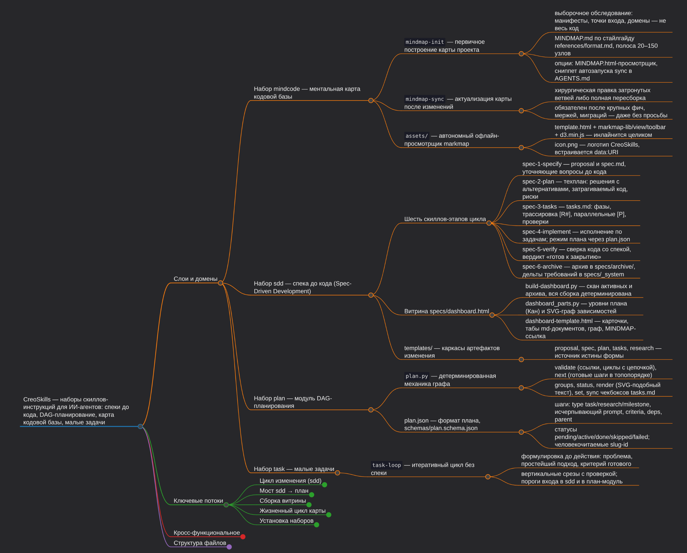

# CreoSkills — мои скиллы для ИИ-агентов


[CreoSkills](https://gitrepo.ru/neonxp/skills) — коллекция скиллов в открытом
формате [Agent Skills](https://agentskills.io): каталог со `SKILL.md` и
вспомогательными файлами. Верхняя директория репозитория — один устанавливаемый
**набор** (может содержать несколько связанных скиллов).

> 🗺️ **Начинаете с репозиторием?** Откройте [MINDMAP.md](MINDMAP.md) —
> ментальную карту: что за наборы, как связаны, что где лежит

[](mindmap.png)

| Набор      | Скиллы                                                                                                 | Назначение                                                                                                                                                                            |
| ---------- | ------------------------------------------------------------------------------------------------------ | ------------------------------------------------------------------------------------------------------------------------------------------------------------------------------------- |
| `mindcode` | `mindmap-init`, `mindmap-sync`                                                                         | ментальная карта кодовой базы: построение `MINDMAP.md` + актуализация после фич                                                                                                       |
| `task`     | `task-loop`                                                                                            | итеративный цикл малых задач: проблема → простейший подход → критерий готового → вертикальные срезы; между «тривиальностью» и sdd                                                     |
| `sdd`      | `spec-1-specify`, `spec-2-plan`, `spec-3-tasks`, `spec-4-implement`, `spec-5-verify`, `spec-6-archive` | спека до кода: цикл «спецификация → план → задачи → код → сверка → архив», артефакты в `specs/` + витрина `specs/dashboard.html`, синергия с `mindcode`                               |
| `plan`     | `plan`                                                                                                 | модуль DAG-планирования: `plan.json` в проекте + детерминированный `plan.py` (циклы, готовность, порядок, прогресс, sync задач); потребители — sdd, task-loop, итеративная разработка |

## Как работает установка

По правилам [AGENTS.md](AGENTS.md):

1. Источник истины — `~/.agents/skills/`: установщик копирует туда каталог каждого скилла.
2. Агенты, которые сами читают `~/.agents/skills/` (Pi, Gemini CLI, Goose, Kimi Code CLI,
   Warp, OpenClaw, Dexto), — больше ничего не требуется.
3. Остальным агентам (Claude Code, Cursor, Codex CLI, …) по умолчанию ничего не ставится;
   симлинк `~/.agents/skills/<скилл>` → `<глобальная директория агента>/<скилл>` создаётся
   только по явному `--agents`.

## Быстро: одна команда

```sh
# все наборы (mindcode, sdd, task, plan), без симлинков
curl -fsSL https://gitrepo.ru/neonxp/skills/raw/branch/master/install.sh | sh

# один набор: mindcode | sdd | task
# (за один запуск — один набор; несколько = запусти несколько раз)
curl -fsSL https://gitrepo.ru/neonxp/skills/raw/branch/master/install.sh | sh -s -- sdd
curl -fsSL https://gitrepo.ru/neonxp/skills/raw/branch/master/install.sh | sh -s -- task

# всё + симлинки выбранным агентам (имена — как в --list, через запятую)
curl -fsSL https://gitrepo.ru/neonxp/skills/raw/branch/master/install.sh | sh -s -- --agents "claude code,codex cli"
```

Требуется только POSIX sh (dash/bash), curl и tar.

## Из клона

```sh
git clone https://gitrepo.ru/neonxp/skills && cd skills
./install.sh                          # все наборы (mindcode, sdd, task, plan)
./install.sh sdd                      # один набор: mindcode | sdd | task | plan
./install.sh --list                   # какие наборы и агенты есть
./install.sh --agents all             # + симлинки всем агентам-«симлинкам»
./install.sh --remove sdd             # снять набор (копии и симлинки)
./install.sh --remove --agents all    # снять всё, что ставили
```

Обновление = повторный запуск: копии в `~/.agents/skills/` перезаписываются,
симлинки продолжают указывать на те же пути.

## Силами ИИ-агента (без терминала)

Скопируйте своему агенту:

> Склонируй https://gitrepo.ru/neonxp/skills во временную директорию и установи мне
> набор sdd (другие: mindcode, task, plan), следуя README.md этого репозитория:
> `./install.sh sdd`, а если моему агенту нужен симлинк (список — `./install.sh --list`)
> — добавь `--agents "Имя"`. В конце отчитайся: что и куда установлено.

# rules.md — правила процесса проекта

## Зачем он нужен

Скиллы кодифицируют **наш дефолтный** процесс: как вести спеку, когда собирать
план, что считать готовым. Но у каждой команды свой процесс: свой трекер, свои
ветки, своё ревью, свой реестр доменов. `rules.md` — единственная точка, где
команда перенастраивает поведение агентов под себя, **не форкая скиллы**:
файл в корне проекта, а набор остаётся общим и обновляется независимо.

## Главный принцип — приоритет

Инструкции из `rules.md` **превалируют над любым скиллом** (`sdd`, `mindcode`,
`plan`, `task`) — даже если полностью противоречат ему. Например, если скилл
говорит «закоммить логическую группу», а в `rules.md` написано «агент не делает
коммитов — только предлагает изменения», агент подчинится `rules.md`.

Из этого следуют две вещи:

- пишите в `rules.md` только то, что должно **пересилить** дефолт; всё прочее
  дублировать бессмысленно — дефолты и так работают;
- пишите аккуратно: ошибочная строка в `rules.md` сильнее любой логики скилла.

## Кто пишет и кто читает

- **Пишет и правит — команда, люди.** Скиллы файл не создают, не перезаписывают
  и не «предлагают улучшения» — только читают и следуют.
- **Читают — агенты**, каждый раз при запуске скилла (у каждого скилла это
  первое правило). Поэтому файл должен быть коротким: он читается целиком.
- Живёт в корне проекта-потребителя, рядом с `AGENTS.md`. Формат — свободный
  markdown, структура не навязывается.

## Что туда заносить (типовые секции)

- **Команда и роли** — кто есть кто, кто принимает решения, к кому идти с вопросом.
- **Таск-трекер** — система; есть ли у агента доступ; таблица переходов статусов:
  кто и когда переводит (агент предлагает — человек жмёт кнопку, или наоборот).
- **Git-процесс** — ветвление и именование; разрешён ли прямой пуш; правила PR;
  что агент вправе коммитить сам, а что только предлагает.
- **Ревью** — что ревьюится, кем, в каком порядке, критерии принятия.
- **«Готово»** — обязательные перед завершением команды (линтеры, тесты,
  сборка); куда ведёт вердикт скилла (например, `spec-5-verify` → тикет
  «Code Review», а не «Done»).
- **Артефакты и конвенции** — каталоги изменений, языки ответов и комментариев,
  реестр доменов, naming-правила спек.

## Как писать хорошо

- Императивно и проверимо: «после каждой задачи запускай `make lint`», а не
  «следи за качеством».
- Одна мысль — один пункт; конкретика вместо деклараций.
- Пишите **отличия от дефолта**, а не пересказ скиллов своими словами — расхождения
  между двумя источниками запутают агента сильнее, чем их отсутствие.
- Разграничение с `AGENTS.md`: общие правила работы с кодом — там; конвенции
  **процесса команды** — здесь.
- Файла нет или секция пуста — работают дефолты скиллов.
